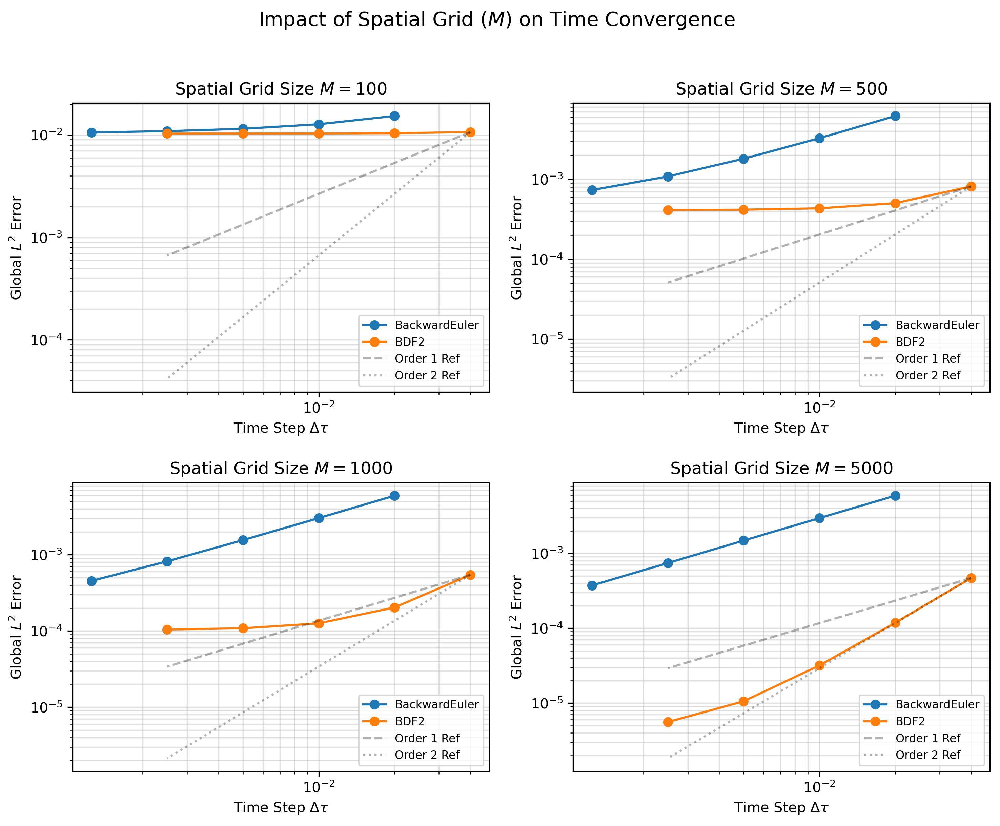
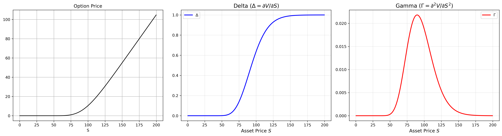

# Numerical Pricing of European Call Options via Method of Lines


**Course:** MATH 514 - Numerical Analysis (Fall 2025)  
**Author:** Yifan Yang  
**Institution:** University of Wisconsin-Madison

## 📖 Project Overview
This project implements a numerical solver for the Black-Scholes Partial Differential Equation (PDE) to price European Call Options. 

Instead of traditional Finite Difference Methods (FDM) applied simultaneously to space and time, we utilize the **Method of Lines (MOL)**. This technique semi-discretizes the spatial domain first, converting the PDE into a large system of stiff Ordinary Differential Equations (ODEs). These ODEs are then integrated using implicit time-stepping schemes suitable for stiff problems.

### Core Objectives
1.  **Model Construction**: Discretize the Black-Scholes PDE with a **Dividend Yield ($q$)** correction.
2.  **Numerical Analysis**: Compare the stability and convergence of **Backward Euler** vs. **BDF2**.
3.  **Validation**: Verify results against the exact solution and real-world market data (Apple Inc., NVDA, etc.).

## 🧮 Mathematical Methodology
The solver addresses the generalized Black-Scholes PDE:

$$
\frac{\partial V}{\partial \tau} = \frac{1}{2}\sigma^2 S^2 \frac{\partial^2 V}{\partial S^2} + (r - q) S \frac{\partial V}{\partial S} - rV
$$

**Numerical Schemes Implemented:**
* **Space**: Central Difference approximations on a finite grid ($S \in [0, S_{max}]$).
* **Time**: 
    1.  **Backward Euler**: 1st-order, A-stable (Implicit).
    2.  **BDF2 (Backward Differentiation Formula)**: 2nd-order, A-stable (Implicit multistep).

## 📊 Results & Analysis

### 1. Convergence Analysis
We empirically verified the theoretical Order of Convergence (EOC) for both methods. 
* **Backward Euler**: Converged with order $\approx 1.0$.
* **BDF2**: Converged with order $\approx 2.0$, providing superior accuracy for a given computational cost.


*Fig 1. Log-Log plot demonstrating temporal error convergence.*

### 2. Real-World Case Study: Apple Inc. (AAPL)
We priced AAPL Call Options expiring Jan 2026. The study highlighted the importance of including the Dividend Yield ($q$) in the drift term.

| Metric | Value | Note |
| :--- | :--- | :--- |
| **Market Price (Mid)** | ~$8.53 | Bid: 7.95 / Ask: 9.10 |
| **Market Price (Last)**| ~$9.15 | Potentially non-synchronous |
| **Model Price** | **~$9.55** | with $q \approx 0.37\%$ correction |

*Detailed analysis of the Bid-Ask spread and the "NVDA Anomaly" is included in the notebook.*

### 3. The Greeks
The project also numerically computes **Delta ($\Delta$)** and **Gamma ($\Gamma$)** via central differences. These sensitivities are critical for dynamic hedging strategies.


*Fig 2. Numerical approximation of Option Price, Delta, and Gamma.*

## 📂 Repository Structure
```text
MATH514_FinalProject/
│
├── BS_Solver.py                    # [Core] Numerical engine (Class & Solvers)
├── 01_Verification_Analysis.ipynb  # [Analysis] Math verification, EOC analysis, Greeks plotting
├── 02_RealWorld_CaseStudy.ipynb    # [Analysis] Real-world validation (AAPL, NVDA, etc.)
├── Report_Draft.pdf                # Final project paper
├── requirement.txt                 # Dependencies
├── README.md                       # Documentation
└── images/                         # Generated plots
    ├── L-L_result.png
    ├── greeks_plot.png
    └── spatial_impact_analysis
```

## 🚀 How to Run

1.  **Clone the repository**:

    ```bash
    git clone https://github.com/franxyang/MATH514FinalProject-BS_Model.git
    cd MATH514FinalProject-BS_Model
    ```

2.  **Install dependencies**:

    ```bash
    pip install -r requirements.txt
    ```

3.  **Run the Notebook**:

    ```bash
    jupyter notebook Final_Project_Main.ipynb
    ```

## 🛠 Dependencies

  * `numpy`: Matrix operations and vectorization.
  * `scipy`: Sparse matrix construction (`scipy.sparse`) and linear solvers (`spsolve`).
  * `matplotlib`: Visualization of convergence plots and solution surfaces.
  * `yfinance` (Optional): Fetching real-time market data for validation.

## 📝 Acknowledgements

  * **Textbook**: Süli, E., & Mayers, D. (2003). *An Introduction to Numerical Analysis*. Cambridge University Press. (Chapter 12).
  * **Assistance**: Portions of the code structure and debugging were assisted by AI tools (ChatGPT/Gemini), cited in the final report.
