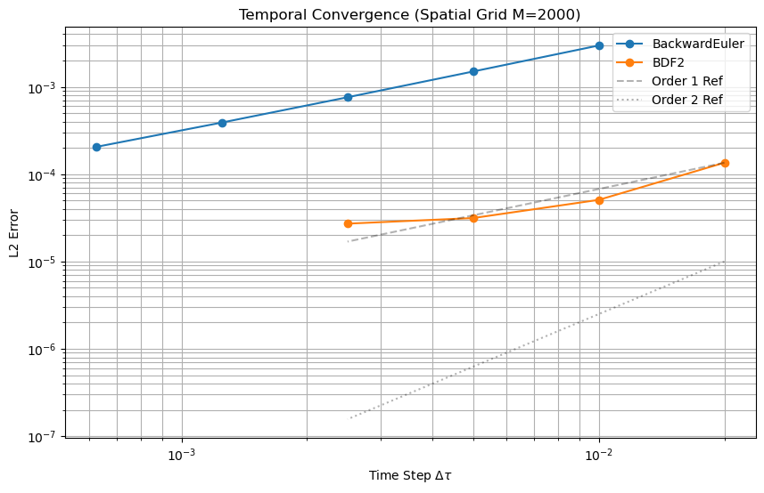

# Numerical Pricing of Call Options using Method of Lines
**Course:** MATH 514 - Numerical Analysis (Fall 2025)  
**Author:** [Your Name]

## Project Overview
This project solves the Black-Scholes Partial Differential Equation (PDE) numerically to price European Call Options. Instead of standard finite difference methods, we employ the **Method of Lines (MOL)** to convert the PDE into a stiff system of ODEs, which is then solved using:
1.  **Backward Euler** (Implicit, 1st Order)
2.  **BDF2** (Implicit, 2nd Order)

## Key Features
* **Mathematical Derivation**: Semi-discretization of the PDE including **Dividend Yield ($q$)** correction.
* **Convergence Analysis**: Empirical verification of time-stepping convergence rates (EOC).
* **The Greeks**: Numerical approximation of Delta ($\Delta$) and Gamma ($\Gamma$).
* **Real-World Validation**: Case study on **Apple Inc. (AAPL)** options using live market data via `yfinance`.

## Results
### 1. Convergence
We successfully demonstrated that BDF2 achieves 2nd-order convergence while Backward Euler achieves 1st-order convergence.


### 2. AAPL Case Study
Including the dividend yield ($q \approx 0.37\%$) significantly improved pricing accuracy compared to the standard model.
* **Market Price**: ~$8.53 (Mid) / $9.15 (Last)
* **Model Price**: ~$9.55
* *Discussion on Bid-Ask spread and IV synchronization is included in the notebook.*

## How to Run
1.  Clone the repository.
2.  Install dependencies:
    ```bash
    pip install -r requirements.txt
    ```
3.  Open `Final_Project_Main.ipynb` in Jupyter Notebook.

## Dependencies
* `numpy`
* `scipy`
* `matplotlib`
* `yfinance` (Optional, for real-time data fetching)